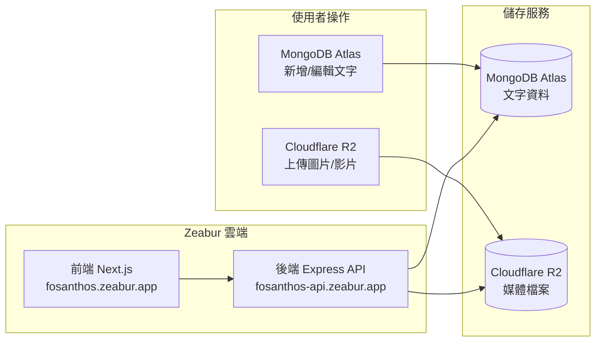

# Fosanthos 心光卉 — 內容管理操作手冊

> 本文件涵蓋文章新增、圖片/影片上傳、以及各服務平台的操作指引。

---

## 目錄

1. [系統架構總覽](#系統架構總覽)
2. [服務平台登入資訊](#服務平台登入資訊)
3. [日常操作：新增文章](#日常操作新增文章)
4. [日常操作：上傳圖片與影片](#日常操作上傳圖片與影片)
5. [API 端點參考](#api-端點參考)
6. [環境變數清單](#環境變數清單)
7. [常見問題](#常見問題)

---

## 系統架構總覽



| 服務 | 用途 | 網址 |
|---|---|---|
| **前端網站** | 使用者瀏覽的網站 | [fosanthos.zeabur.app](https://fosanthos.zeabur.app) |
| **後端 API** | 資料查詢與寫入 | [fosanthos-api.zeabur.app](https://fosanthos-api.zeabur.app) |
| **MongoDB Atlas** | 儲存文章文字資料 | [cloud.mongodb.com](https://cloud.mongodb.com) |
| **Cloudflare R2** | 儲存圖片與影片檔案 | [dash.cloudflare.com](https://dash.cloudflare.com) |
| **Zeabur** | 雲端部署平台 | [zeabur.com](https://zeabur.com) |

---

## 服務平台登入資訊

### MongoDB Atlas
- 🔗 網址：[cloud.mongodb.com](https://cloud.mongodb.com)
- Cluster：`Cluster0`
- Database：`fosanthos`
- Collection：`posts`

### Cloudflare R2
- 🔗 網址：[dash.cloudflare.com](https://dash.cloudflare.com)
- Bucket：`fosanthos-offical`
- 公開存取網址前綴：`https://pub-159d2f1534984928bc80b1820c8267c0.r2.dev/`

### Zeabur
- 🔗 網址：[zeabur.com](https://zeabur.com)
- Region：Japan
- 專案內含兩個 Service：前端（Next.js）與後端（Express）

---

## 日常操作：新增文章

### 方法一：透過 MongoDB Atlas 網頁（推薦）

> [!TIP]
> 這是最簡單的方式，不需要寫任何程式碼。

**步驟：**

1. 登入 [MongoDB Atlas](https://cloud.mongodb.com)
2. 點選 **Cluster0** → **Browse Collections**
3. 左側選擇 `fosanthos` → `posts`
4. 點選右上角 **Insert Document**
5. 切換到 **JSON 模式**（點 `{}`）
6. 貼入以下格式，修改內容後按 **Insert**：

```json
{
  "id": "teacher-3",
  "category": "teacher",
  "categoryLabel": "寶老師短文",
  "title": "文章標題",
  "excerpt": "文章摘要（顯示在列表頁）...",
  "content": "完整文章內容...\n\n換行用 \\n\\n 分隔段落",
  "date": "2026 年 5 月 12 日",
  "author": "寶老師",
  "image": "圖片網址（見下方說明）",
  "featured": true
}
```

### 欄位說明

| 欄位 | 必填 | 說明 | 範例 |
|---|---|---|---|
| `id` | ✅ | 唯一識別碼（英文+數字） | `"teacher-3"` |
| `category` | ✅ | 分類代碼（見下方表格） | `"teacher"` |
| `categoryLabel` | ✅ | 分類顯示名稱 | `"寶老師短文"` |
| `title` | ✅ | 文章標題 | `"新的體悟"` |
| `excerpt` | ✅ | 摘要（列表頁顯示） | `"一段簡短描述..."` |
| `content` | ✅ | 完整內容（`\n` 換行） | `"第一段\n\n第二段"` |
| `date` | ✅ | 日期 | `"2026 年 5 月 12 日"` |
| `author` | ✅ | 作者 | `"寶老師"` |
| `image` | ❌ | 封面圖片網址 | R2 網址或 `/圖片.jpg` |
| `gallery` | ❌ | 圖片集（陣列） | `["/photo1.jpg"]` |
| `featured` | ❌ | 是否為精選文章 | `true` / `false` |

### 分類代碼對照表

| `category` | `categoryLabel` |
|---|---|
| `student` | 學員奇蹟分享 |
| `course` | 近期課程推廣 |
| `teacher-course` | 寶老師課程 |
| `teacher` | 寶老師短文 |
| `video` | 影音分享 |

> [!IMPORTANT]
> `category` 和 `categoryLabel` 必須成對使用，請嚴格按照上表填寫。

---

### 方法二：透過 API（適合程式化操作）

**新增單篇文章：**

```bash
POST https://fosanthos-api.zeabur.app/api/posts
Content-Type: application/json

{
  "id": "student-3",
  "category": "student",
  "categoryLabel": "學員奇蹟分享",
  "title": "新的分享",
  "excerpt": "摘要...",
  "content": "內容...",
  "date": "2026 年 5 月 12 日",
  "author": "學員 小明",
  "image": "https://pub-159d2f1534984928bc80b1820c8267c0.r2.dev/photo.jpg",
  "featured": false
}
```

**批次新增多篇文章：**

```bash
POST https://fosanthos-api.zeabur.app/api/posts/batch
Content-Type: application/json

[
  { "id": "student-3", ... },
  { "id": "student-4", ... }
]
```

---

## 日常操作：上傳圖片與影片

### 方法一：透過 Cloudflare R2 網頁上傳（推薦）

> [!TIP]
> 適合上傳文章封面圖、活動照片、影片等媒體檔案。

**步驟：**

1. 登入 [Cloudflare Dashboard](https://dash.cloudflare.com)
2. 左側選單 → **R2 Object Storage**
3. 點選 Bucket：**`fosanthos-offical`**
4. 點 **Upload** → 選擇檔案 → 上傳完成
5. 檔案的公開網址格式為：

```
https://pub-159d2f1534984928bc80b1820c8267c0.r2.dev/你的檔名.jpg
```

6. 將此網址填入 MongoDB 文章的 `image` 欄位

**建議的檔案命名規則：**

```
blog_文章類型_日期.jpg
例如：blog_student_20260512.jpg
      blog_course_3day_cover.jpg
      video_miracle_share.mp4
```

> [!WARNING]
> 上傳的檔案名稱**不要包含中文或空格**，建議使用英文 + 底線命名。

### 方法二：透過 API 上傳（程式化操作）

```bash
POST https://fosanthos-api.zeabur.app/api/upload
Content-Type: multipart/form-data

file: (選擇檔案)
title: "文章標題"
content: "文章內容"
```

此 API 會自動：
- 將檔案上傳至 Cloudflare R2
- 在 MongoDB 建立一筆新文章並附上檔案網址

---

### 現有圖片位置對照

| 圖片 | 目前位置 | 說明 |
|---|---|---|
| `logo.png`, `logo_full.png`, `logo_square.png` | `public/` 資料夾 | 網站 Logo，不需搬移 |
| `hero_flower.png`, `hero_flower.mp4` | `public/` 資料夾 | 首頁素材，不需搬移 |
| `about_meditation.png`, `teacher.jpg`, `india_course.png` | `public/` 資料夾 | 頁面固定素材 |
| `blog_student.png`, `blog_teacher.png` 等 | `public/` 資料夾 | 舊文章圖，可保留 |
| **未來新增的圖片/影片** | ➡️ **Cloudflare R2** | 不需重新部署 |

> [!NOTE]
> `public/` 資料夾的圖片在 MongoDB 中以 `/檔名.jpg` 路徑引用，例如 `"/blog_teacher.png"`。
> Cloudflare R2 的圖片則使用完整網址，例如 `"https://pub-159d2f1534984928bc80b1820c8267c0.r2.dev/new_photo.jpg"`。

---

## API 端點參考

| 方法 | 路徑 | 功能 | 範例 |
|---|---|---|---|
| `GET` | `/api/posts` | 取得所有文章 | [連結](https://fosanthos-api.zeabur.app/api/posts) |
| `GET` | `/api/posts?category=student` | 依分類篩選 | 篩選學員文章 |
| `GET` | `/api/posts/:id` | 取得單篇文章 | `/api/posts/teacher-1` |
| `POST` | `/api/posts` | 新增一篇文章（純文字） | 見上方範例 |
| `POST` | `/api/posts/batch` | 批次新增文章 | 傳入陣列 |
| `POST` | `/api/upload` | 上傳檔案 + 建立文章 | multipart/form-data |

---

## 環境變數清單

### 後端 Service（Express）— Zeabur 環境變數

| Key | Value | 說明 |
|---|---|---|
| `PORT` | `8080` | 伺服器 Port |
| `MONGO_URI` | `mongodb+srv://...` | MongoDB 連線字串 |
| `R2_ENDPOINT` | `https://f4bf188a...r2.cloudflarestorage.com` | R2 API 端點 |
| `R2_ACCESS_KEY` | `ca78cdff...` | R2 存取金鑰 |
| `R2_SECRET_KEY` | `4e4cad48...` | R2 密鑰 |
| `R2_BUCKET_NAME` | `fosanthos-offical` | R2 Bucket 名稱 |
| `R2_PUBLIC_URL` | `https://pub-159d2f...r2.dev` | R2 公開存取網址 |

### 前端 Service（Next.js）— Zeabur 環境變數

| Key | Value | 說明 |
|---|---|---|
| `NEXT_PUBLIC_API_URL` | `https://fosanthos-api.zeabur.app` | 後端 API 網址 |
| `GMAIL_USER` | `sam6091260@gmail.com` | 聯絡表單寄件人 |
| `GMAIL_APP_PASSWORD` | `ttfclvlp...` | Gmail 應用程式密碼 |

---

## 常見問題

### Q: 新增文章後前端沒有顯示？
- 前端每次載入頁面都會重新請求 API，**不需要重新部署**
- 請確認 MongoDB 中的 `category` 欄位是否正確（必須是 `student` / `course` / `teacher` / `teacher-course` / `video` 之一）
- 用瀏覽器打開 `https://fosanthos-api.zeabur.app/api/posts` 確認 API 有回傳新文章

### Q: 上傳圖片到 R2 後，文章要怎麼引用？
- 將 R2 的完整網址填入文章的 `image` 欄位：
  ```
  https://pub-159d2f1534984928bc80b1820c8267c0.r2.dev/你的檔名.jpg
  ```

### Q: 想修改或刪除文章？
- 在 MongoDB Atlas → Browse Collections → 找到該文章
  - **修改**：點該筆資料的鉛筆 ✏️ 圖示
  - **刪除**：點該筆資料的垃圾桶 🗑️ 圖示

### Q: `seed.js` 什麼時候用？
- **僅在需要完全重置所有文章資料時使用**
- ⚠️ 執行 `node seed.js` 會**清空所有現有資料**再重新匯入
- 日常新增/編輯請使用 MongoDB Atlas 網頁

### Q: 後端掛了怎麼辦？
- 到 Zeabur → 後端 Service → **服務狀態** 查看日誌
- 如果有錯誤，嘗試點 **Redeploy** 重新部署
- 確認環境變數是否正確設定

---

> 📅 最後更新：2026 年 5 月 12 日
